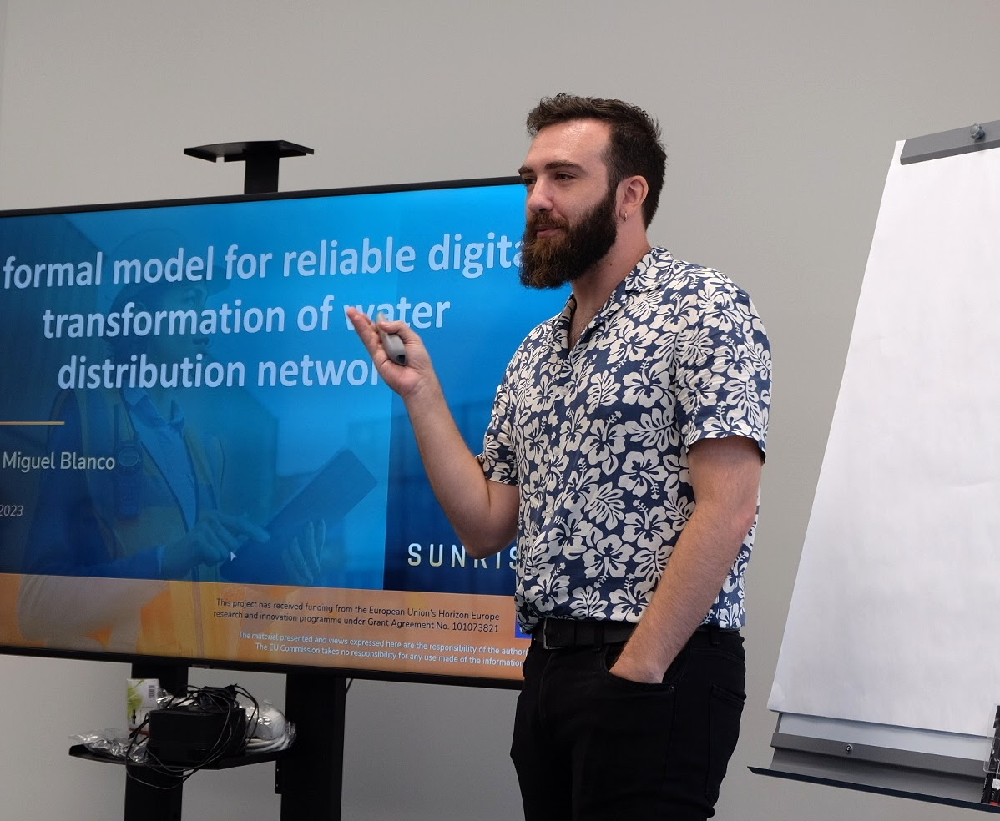

# José Miguel Blanco
Welcome to my personal webpage.

I am a postdoctoral researcher in the Escuela Técnica Superior de Ingenieros de Telecomunicación (ETSIT) at the Universidad Politécnica de Madrid (UPM), Spain, and part of the STRAST research group. My main focus is on Logic, its applications, and the benefits that it provides to the architecture of distributed systems. In this webpage you can find the references to all my publications as well as the projects that I'm and have been part of. 
